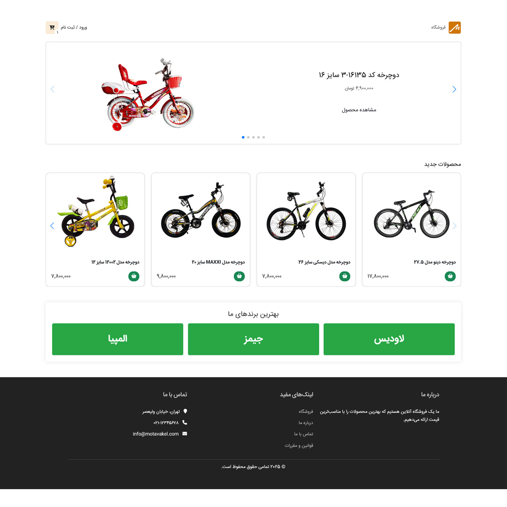
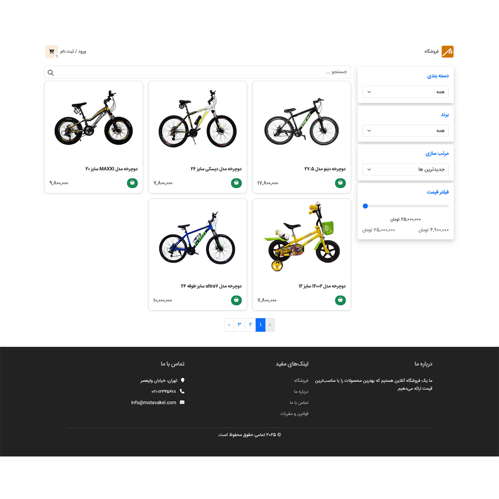
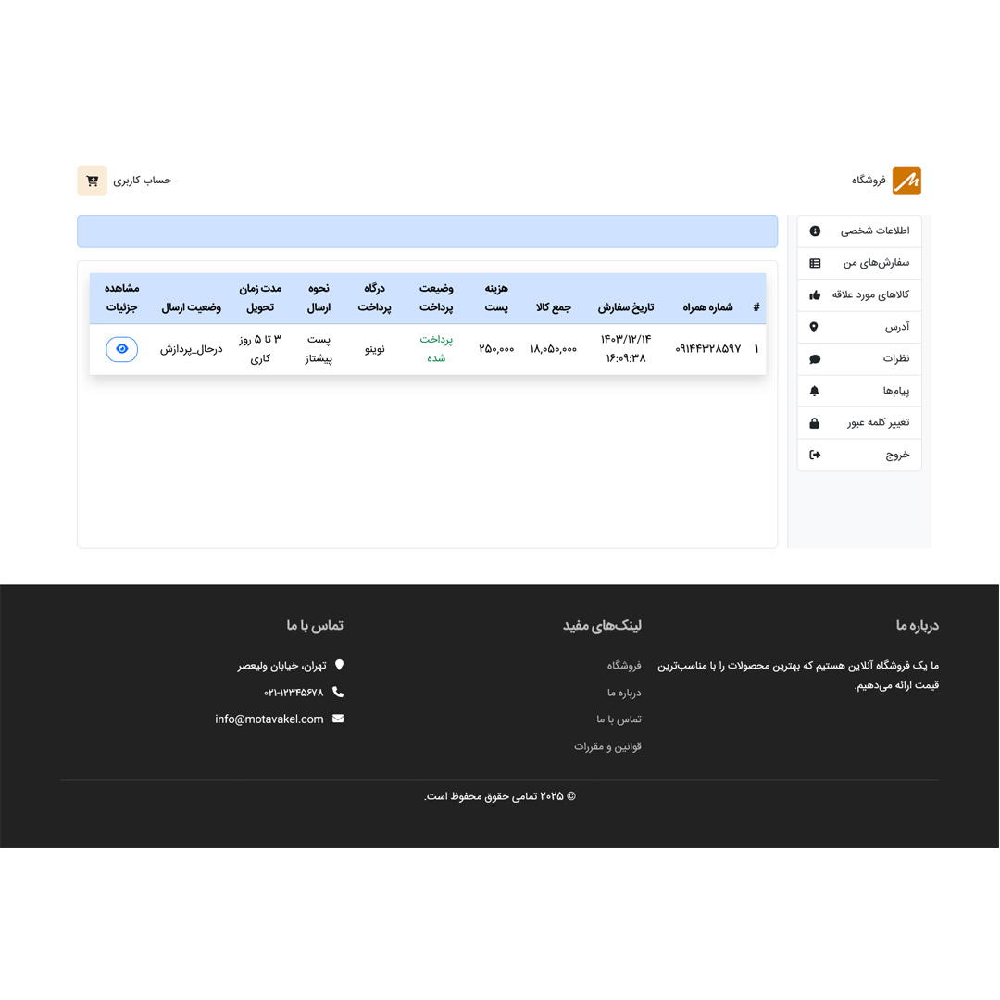
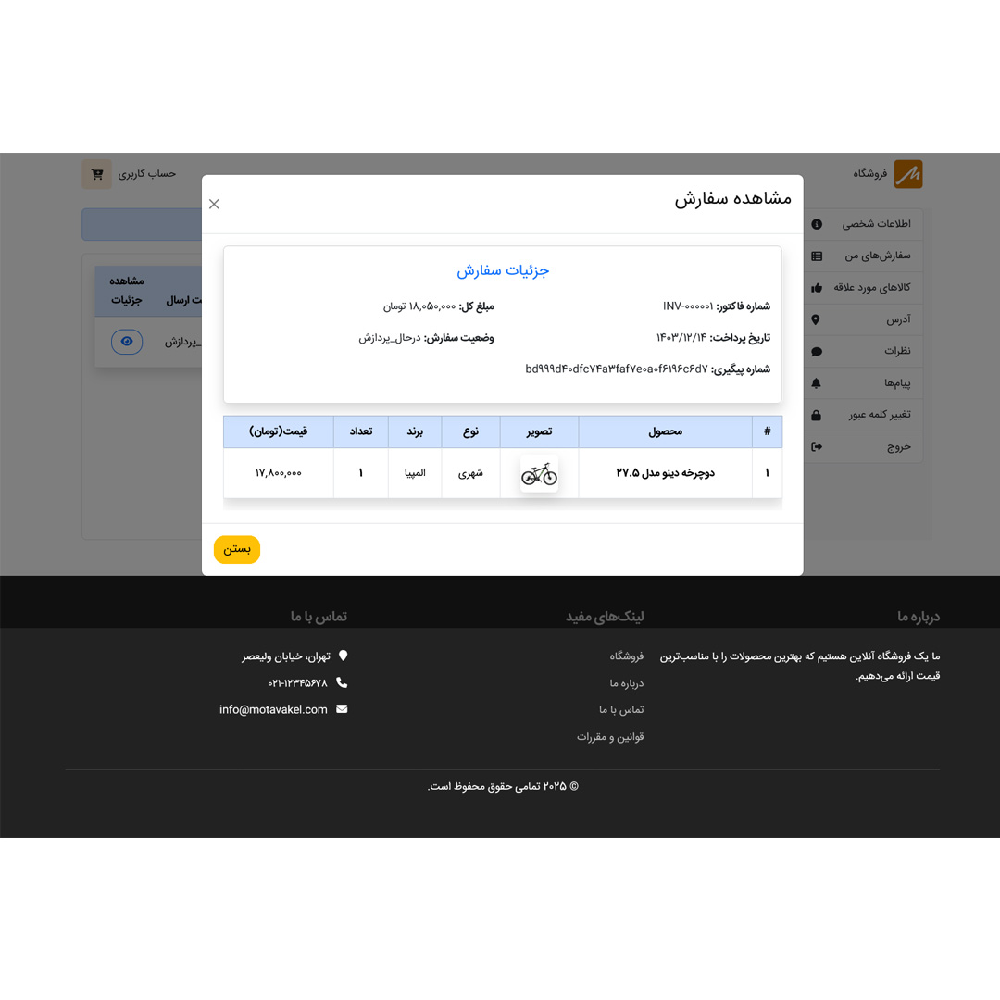
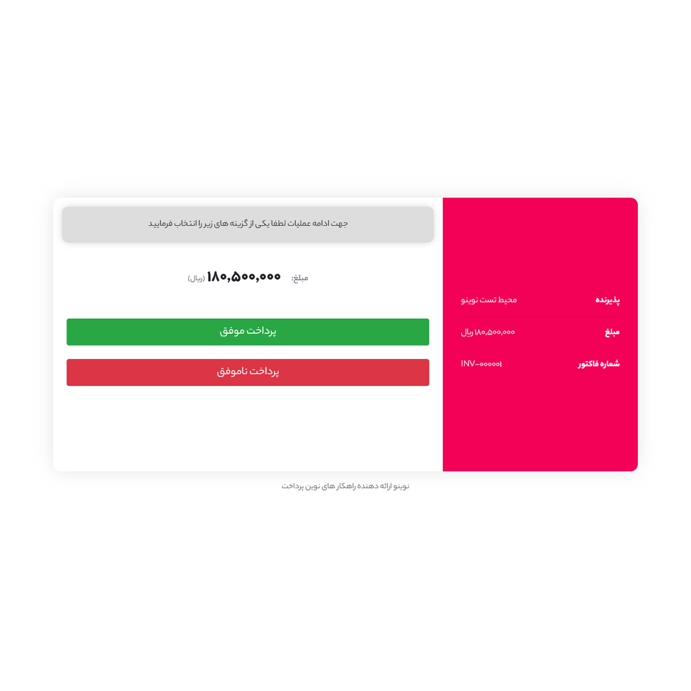
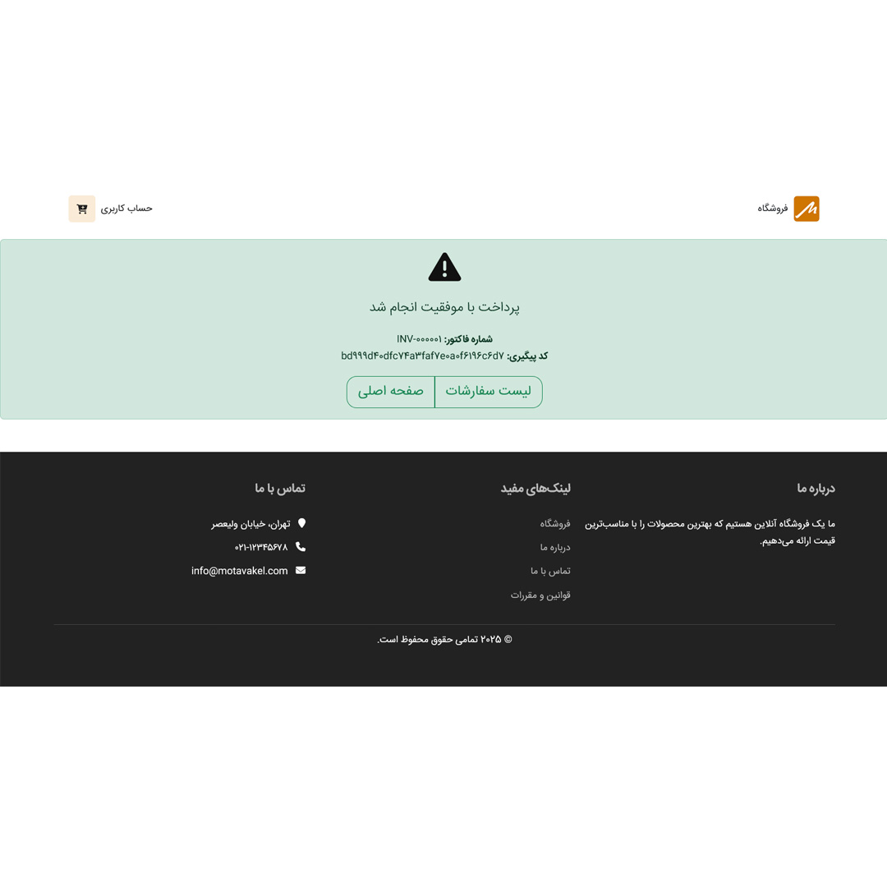

## فروشگاه اینترنتی - بک‌اند دات‌نت و فرانت‌اند انگولار

### گالری تصاویر

  
  
  

  
  
  

---

### معرفی

این پروژه یک فروشگاه اینترنتی با استفاده از **ASP.NET Core** برای بک‌اند و **Angular** برای فرانت‌اند است. بک‌اند بر اساس **معماری تمیز** پیاده‌سازی شده و چندین الگوی طراحی و بهترین شیوه‌ها برای مقیاس‌پذیری و نگهداری آسان در آن استفاده شده است.
 
 

### بک‌اند (ASP.NET Core)

#### ویژگی‌های اصلی
- **معماری تمیز**: سازماندهی لایه‌ها برای تفکیک مسئولیت‌ها و خوانایی بیشتر.
- **الگوی Unit of Work/Generic Repository**: پیاده‌سازی مدیریت تراکنش‌ها و جلوگیری از نوشتن کد تکراری برای هر موجودیت.
- **الگوی Specification**: استفاده از الگو S برای پیاده‌سازی شرط‌های لینک در جنریک ریپوزیتوری.
- **CQRS با MediatR**: پیاده‌سازی الگوی Command Query Responsibility Segregation (CQRS) با استفاده از پکیج MediatR برای جدا کردن عملیات خواندن و نوشتن.
- **دیتابیس Redis**: استفاده از Redis در Docker برای ذخیره‌سازی داده‌های کوتاه‌مدت (e.g ذخیره‌سازی سبد خرید).
- **FluentValidation**: پیاده‌سازی اعتبارسنجی با استفاده از پکیج FluentValidation برای اعتبارسنجی ورودی‌ها.
- **توکن‌های JWT برای احراز هویت**:  پیاده‌سازی سفارشی Authentication با استفاده از Access Token و Refresh Token
- **AutoMapper**: خودکارسازی و ساده‌سازی تبدیل مدل‌ها.
- **پایپ لاین‌های مدیاتور**: استفاده از پایپ لاین‌های متنوع مدیاتور برای اندازه‌گیری مدت زمان پاسخ به درخواست، اعتبارسنجی ورودی و اعمال کشینگ به درخواست‌های پر تکرار (e.g درخواست فیلتر محصولات در صفحه آرشیو محصولات).
- **Identity**: پیاده‌سازی احراز هویت و ثبت‌نام کاربران با استفاده از ASP.NET Identity.
- **تست نویسی با یونیت تست**: استفاده از XUNIT TEST برای تست واحد.
- **Exception Handler**: پیاده سازی اکسپشن هندلر اختصاصی با استفاده از میدل ور و تبدیل اکسپشن پرتاب شده به دادهایی JSON برای نمایش در فرانت  

 
 

### فرانت‌اند (Angular)

ابتدا این پروژه را با استفاده از Angular 15 طراحی کردم. سپس به منظور بهره‌برداری از ویژگی‌های به‌روزتر و بهینه‌تر، آن را به نسخه‌های Angular 18 و 19 ارتقا دادم. در نهایت، برای بهبود ساختار و استقلال بیشتر کد، پروژه را به استندالون کامپوننت‌ها تغییر دادم تا کد به شکل ماژولارتر و انعطاف‌پذیرتر سازماندهی شود

- طراحی صفحه‌های مختلف با استفاده از **Standalone Components**.
- طراحی **پایپ‌های اختصاصی** برای تبدیل تاریخ میلادی به شمسی و سایر تبدیل‌های مورد نیاز.
- **مدیریت وضعیت با RxJS** برای کنترل استیت‌های مختلف در اپلیکیشن.
- استفاده از **گاردها** برای محافظت از صفحات و محدود کردن دسترسی کاربران به بخش‌های خاص.
- استفاده از **اینترسپتور** برای ارسال توکن در هدر درخواست‌ها به سرور برای احراز هویت و اعتبارسنجی.
- پیاده‌سازی **فرم کنترلرهای پیشرفته** برای اعتبارسنجی ورودی‌های کاربر به صورت داینامیک و با قابلیت‌های پیشرفته.
- طراحی و پیاده‌سازی صفحه **آرشیو محصولات** با فیلترهای مختلف (مانند فیلتر بر اساس برند، دسته‌بندی، قیمت، و ...).
- پیاده‌سازی کامل **درگاه پرداخت** با رعایت پروتکل‌های امنیتی و ارسال داده‌ها به درگاه‌های پرداخت آنلاین.
- استفاده از **RxJS** برای مدیریت درخواست‌های غیر همزمان و بهینه‌سازی عملکرد.

---

## راه‌اندازی پروژه

- **Docker**: برای اجرای Redis در کانتینر.
- **.NET SDK**: برای ساخت و اجرای بک‌اند.
- **Node.js و Angular CLI**: برای ساخت و اجرای فرانت‌اند.

### راه‌اندازی بک‌اند با ویژوال استودیو
1. مخزن را کلون کنید.
2. با توجه به تعریف داکر فایل و داکر کمپوزر و انجام تنظیمات موردنیاز، فقط **Configuration Dropdown** را در حالت **docker-compose** قرار دهید.

### راه‌اندازی فرانت‌اند
1. مخزن را کلون کنید.
2. با استفاده از دستور `npm install` وابستگی‌ها را نصب کنید.
3. از دستور `ng serve` برای راه‌اندازی فرانت‌اند استفاده کنید.
